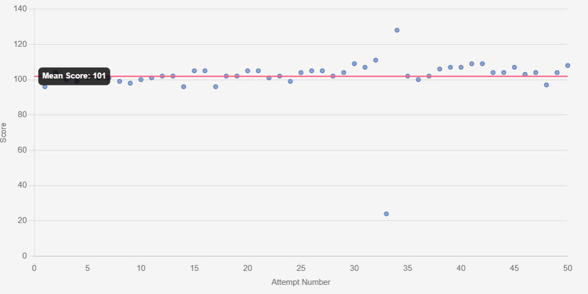

# Hi, I'm Sanskaar Srivastava 👋

Welcome to my GitHub profile! I'm currently pursuing a **B.Tech in Chemical Engineering** along with a **BS in Statistics and Data Science** at the **Indian Institute of Technology, Kanpur** (IITK). My academic interests span across **Mathematics**, **Data Science**, and **Algorithms**, and this space serves as a journal for my journey towards mastering these fields and securing a role in **Quantitative Finance (Quant)**, **Software Engineering (SWE)**, or **Machine Learning (ML)**.

### 🎓 A Bit About My Background:
I’ve always been fascinated by **Mathematics**, especially its applications in real-world problem-solving. This interest led me to dive deeper into **Data Science**, where I’ve explored everything from **statistical modeling** to **optimization techniques**. My dual degree program has given me a unique perspective on solving problems, both from an engineering standpoint and through data-driven insights.

This repository documents my learning, projects, coding experiences, and research as I progress through my academic and professional journey. Whether you're here to collaborate or simply explore, I hope you find something useful!

### 💻 What I’ve Been Working On:
I started coding in my **first year at IITK**, and since then, my focus has shifted toward mastering **Data Structures** and **Algorithms**. I'm actively involved in coding competitions and have been improving steadily. You can find me on **[Codeforces](https://codeforces.com/profile/Damn_NA)**, where I am currently rated as a **Specialist** with a score of **1426**. Here’s a breakdown of my coding journey:
- **Data Structures**: Arrays, Trees, Linked Lists, Graphs, Heaps
- **Algorithms**: Dynamic Programming, Greedy Algorithms, Graph Traversals, Sorting & Searching

I regularly solve problems on platforms like **LeetCode** and **CodeChef**, continuously striving to enhance my problem-solving capabilities. Feel free to check out my solutions and projects here as I work to refine my skills!

### ⚡ My Interest in Speed Maths:
Alongside coding, I am a huge fan of **speed maths**! I regularly practice on platforms like **Zetamac**, **Quantguide**, and **Mathdash**. Currently, I’m averaging a **sub-100** score on Quantguide and have a **peak rating of 2565** on Mathdash. I love challenging myself and tracking my progress in these areas.

### 📈 Quantguide Scores:
Here’s a snapshot of my progress over time on Quantguide:

### 🔬 Research and Projects:
Over the past two years, I’ve had the opportunity to work on several **research projects** focused on **Machine Learning**, **non-traditional algorithms**, and **optimization techniques**. During this time, I collaborated with:
- **Prof. Apparao Rao** from **Clemson University, USA**
- **Dr. Harsh Vazirani** from **UNSW, Australia**

These collaborations led to the publication of two research papers:
1. **[Research Paper 1](AU120.pdf)**: This research leverages **UAVs** and **CNNs** to automate the detection of crop diseases in apple trees, tackling issues like **class imbalance** and **image processing**. Our model achieved an **80.9% accuracy** on training data and offers a scalable solution for **automated plant disease diagnosis** in agriculture.

2. **[Research Paper 2](link_to_paper_2)**: (Brief description)

These experiences have shaped my understanding of advanced algorithms and machine learning models, and I continue to apply this knowledge to my ongoing projects.

### 🌟 Goals for the Coming Year:
In the next 12 months, I aim to:
- Dive deeper into **non-traditional algorithms** and **optimization techniques**
- Explore **trading algorithms** for **Quantitative Finance**
- Improve my **Codeforces** rating and work towards achieving **Candidate Master** status

By documenting my progress here, I hope to inspire others and keep myself motivated to reach these goals.

### 🤝 Let’s Connect:
I'm always open to discussions, collaborations, and opportunities to learn. Feel free to reach out if you're interested in what I do or if you'd like to collaborate on a project!
- **Codeforces Profile**: [Check it out here!](https://codeforces.com/profile/your_codeforces_id)
- **LinkedIn**: [Connect with me](https://www.linkedin.com/in/your_profile)
- **ResearchGate**: [Explore my research](https://www.researchgate.net/profile/your_profile)

Thanks for visiting my profile! Feel free to explore the repository and get in touch if something catches your interest. 😄
